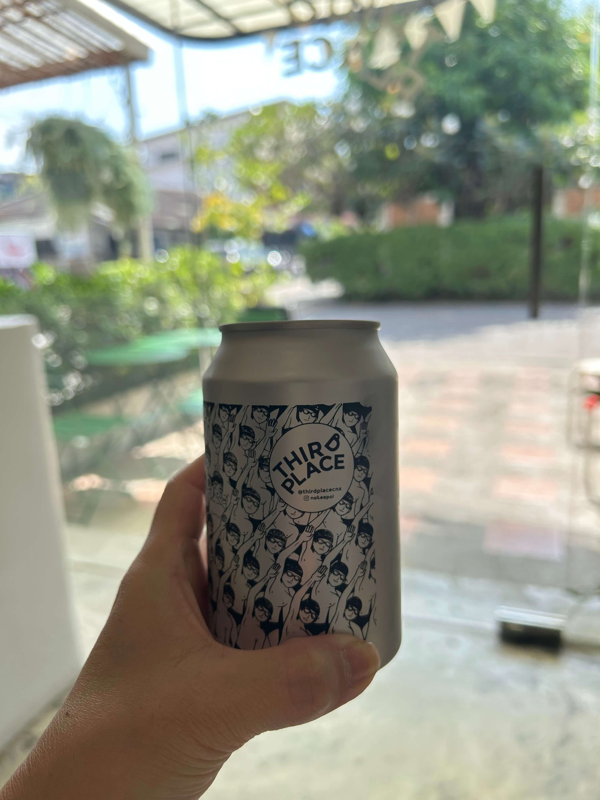
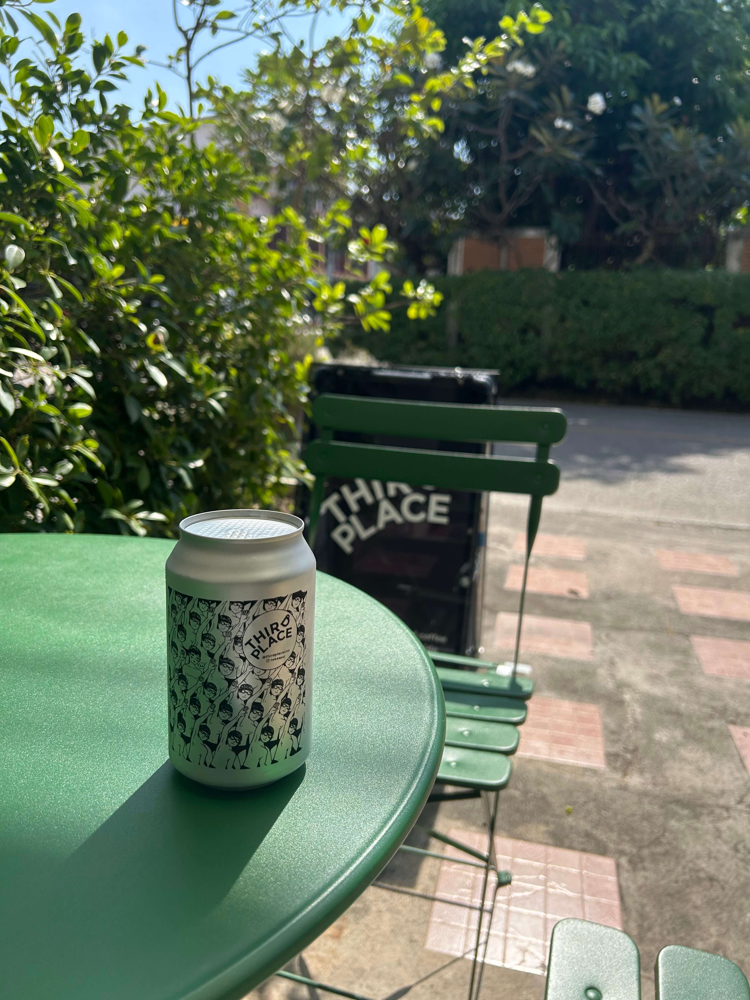

---

## 前言

平常在台灣就偶爾喜歡喝個泰奶，這次去清邁一去就是一個月，出發前就想說該來個泰奶之旅，每天都喝爆泰奶。

所以這次我待在清邁的 24 天，幾乎每天都會來一杯泰奶，不論是咖啡廳、餐廳、路邊攤，只要看到 cha thai 就點！

旅程結束後，就想說來做個戰力排行榜。

**為什麼重要：因為泰奶好喝，獻給每個愛泰奶又要去清邁的人。**

## 戰力排行榜

戰力排行榜聽起來很猛，其實只是印象深刻且覺得好喝的泰奶啦，不過一個泰奶要讓人印象深刻也是不簡單，因為常常就是喝了幾口覺得跟其他的泰奶差不多，然後就默默忘記了，所以記錄下來的都是有特色並且味道特殊的泰奶。

然後我是個木舌，沒辦法講出泰厲害的形容，好喝就是好喝。（諧音讚

這次印象深刻的總共有這幾間，戰力由高排至低：

1. [Charlie](https://maps.app.goo.gl/Eq7HT9wZjk3D1HHKA)

2. [Thrid Place Coffee - Chaing Mai](https://maps.app.goo.gl/o5YjC1g5xg3Q8Cxq5)

3. 飯店自己調的泰奶

其他喝完就忘了，就沒列入排行榜。

### Charlie

這家是專賣泰奶的店，並且從點飲料的流程就不太一樣，首先是可以選泰奶的組合，比如有：

- THE OG：一般的泰奶

- CHARLIE：泰奶 + 海鹽焦糖奶蓋

- SOMSRI：果汁 + 泰奶

- COCO NATACHA：椰子汁 + 泰奶，沒有牛奶

並且還能選擇不同的茶葉，店家會提供幾個不同的盒子讓你聞聞不同的茶葉味道，原本以為聞不出差別，但真的能聞出味道的不同，比如有的聞起來像太妃糖紅茶，有的則是像決明子。

最後我選擇了聞起來像太妃糖的茶葉 + CHARLIE，非常的好喝。

茶味和奶味非常平衡，不會特別偏向哪一邊，令人驚艷的地方在於海鹽焦糖的奶蓋，當有點膩了泰奶的味道以後，搭配奶蓋就帶出另一種風味，鹹鹹甜甜的很順口，味道也非常的協調。

### Third Place Coffee - Chiang Mai

這間是咖啡廳，但泰奶本身也蠻有特色的。

點餐的過程沒什麼特別的，就跟一般點咖啡沒兩樣，特別的是泰奶是包裝到鐵鋁罐裡面，鋁罐本身的設計好看，在炎熱的天氣觸摸到很冰的鋁罐也是非常的爽。

風味也不太一樣，茶味非常濃並帶有一點苦味，在喝泰奶的時候，我喜歡濃濃的茶味搭配一些奶味，因此這罐泰奶非常合我胃口。

### 飯店泰奶

這次住飯店的早餐居然可以自己調泰奶，實際製作才知道原來泰奶就是泰奶茶葉搭配煉乳，飯店提供的就是手標泰奶茶葉 + 煉乳，只要自己調配就可以了。

很意外的是這樣的泰奶就非常好喝，茶味濃郁，奶味也夠，而且平常我都不喝熱的泰奶，雖然還是喜歡冰的，但熱的泰奶挺讓人驚艷，好適合在冬天喝！！
